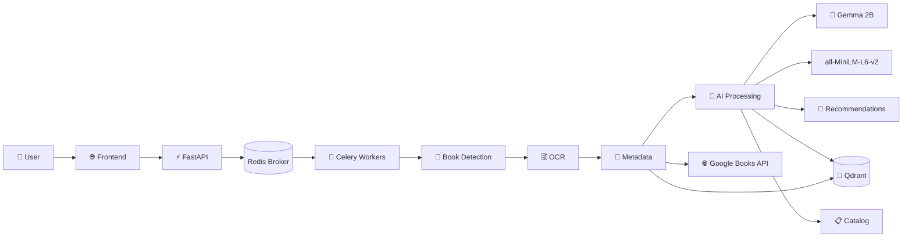

### <CENTER>An AI Lens for ardent readers and librarians alike — powered entirely by open-source AI models. [App Link 🔗](http://bookhead.in/) </CENTER>


<!-- 
## 🔦 OVERVIEW
**BookHead** is an AI-driven application that **helps book readers to find their next read** and **librarians to organize and classify book shelves and generate comprehensive book catalogs**, just by clicking a picture of book shelves. Built on a stack of **open-source models** like Gemma-2B LLM, PaddleOCR and Faster RCNN. It uses highly specialised book detection, OCR, book embeddings, cataloging, and recommendation pipelines — useful for personal libraries, archiving projects, and research collections.
 -->
 
## 🔦 **OVERVIEW**

BookHead AI is an AI-powered web application designed for both readers and librarians. Instead of manually searching through book lists or cataloging shelves one book at a time, users simply upload a photo of books arranged on a bookshelf and let AI handle the rest.

### 📖 **For Readers**

Readers can discover their next favorite book by taking a picture of any bookshelf—whether it's their personal collection, a bookstore display, or a library shelf. BookHead AI analyzes the books in the image and generates personalized recommendations based on preferences such as:

* Mood or reading vibe
* Genre
* Book length
* Number of recommendations desired

The system understands what books are present on the shelf and recommends titles that best match the reader's interests.

### 👨‍🏫 **For Librarians**

Librarians can use BookHead AI to automatically generate a comprehensive digital catalog from bookshelf images. The application identifies books, extracts their information, enriches metadata, and produces structured records that can be downloaded as a CSV file for inventory management and cataloging purposes.

<br>

## 🏗️ **HOW IT WORKS**

BookHead AI combines multiple AI pipelines that work together to transform a simple bookshelf image into actionable insights.

| ✨ Pipelines             | 🦾 Working              |
| -------------------- | ------------------------------ |
| **1. Book Detection Pipeline**         | The uploaded bookshelf image is first processed by a Faster R-CNN object detection model that identifies individual books and locates their spines. Each detected book spine is cropped and prepared for text extraction.                    |
| **2. OCR & Book Identification Pipeline**    | The cropped book spines are passed through an OCR pipeline that extracts text from the images. The extracted text is then cleaned and processed to identify book titles and author names. <br> <ul><li>For the **Reader Workflow**, OCR results are automatically accepted and used to retrieve book metadata from external book databases. </li><li>For the **Librarian Workflow**, OCR confidence scores are evaluated. High-confidence results are automatically accepted, while uncertain results are routed for human review to ensure catalog accuracy. Identified books are then matched against a vector database containing enriched book records.</li></ul> |
| **3. Recommendation Pipeline**         | For readers, BookHead AI builds detailed metadata records for the detected books and generates concise AI-powered summaries using Google's Gemma 2B language model. <br> <ul><li>An embedding-based recommendation engine then converts both books and user preferences into vector representations.</li><li>By computing similarity scores between these vectors, the system ranks and recommends books that best align with the reader's interests.</li></ul>    |
| **4. Catalog Generation Pipeline**         | For librarians, automatically accepted books and human-reviewed records are combined into a unified catalog. Rich metadata is assembled for every identified title, creating a structured inventory that can be exported as a CSV file with a single click.     |

By combining computer vision, OCR, large language models, vector search, and recommendation systems, BookHead AI transforms ordinary bookshelf photos into personalized reading recommendations and production-ready library catalogs.


<br>


## ✨ Features

* **Shelf Recognition** — Detects individual books directly from bookshelf images.
* **Smart OCR** — Extracts book titles and author names from book spines.
* **AI Recommendations** — Generates personalized reading suggestions from your shelf.
* **Preference Matching** — Tailors recommendations using mood, genre, and reading length.
* **Book Summaries** — Creates concise AI-generated summaries for identified books.
* **Library Cataloging** — Converts bookshelf images into structured library catalogs.
* **Human Review** — Supports manual verification for uncertain OCR results.
* **Metadata Enrichment** — Augments books with rich information from external sources.
* **CSV Export** — Download complete library catalogs with a single click.
* **Vector Search** — Matches books using semantic similarity and embeddings.
* **Parallel Processing** — Fast inference powered by Celery workers and Redis.
* **100% Open-Source** — Powered entirely by self-hosted open-source models.

<!--
## ⚡Features
1. **Smart book detection** and **OCR** from uploaded shelf images
2. **Embeddings-based semantic search** and **recommendations**
3. **Automated cataloging** and **metadata extraction** (title, author, ISBN)
4. **Configurable confidence routing** and **review queue** for manual verification
5. **Highly Scalable architecture** with quick background workers for extensive tasks
6. Pluggable **LLM** and **vector store** integrations for flexible retrieval
-->


<br>


## 🏗️ **System Architecture**

BookHead AI follows a distributed, asynchronous architecture designed for fast and scalable AI inference.

1. Users upload bookshelf images through the web interface.
2. The FastAPI backend receives requests and orchestrates workflow execution.
3. Long-running AI tasks are dispatched to Celery workers through Redis.
4. Workers execute specialized pipelines for:
   * Book Detection (Faster R-CNN)
   * OCR & Text Extraction (PaddleOCR)
   * Book Identification & Metadata Enrichment
   * Recommendation Generation
   * Catalog Generation
5. Enriched book records are stored and retrieved using Qdrant Vector Database for semantic matching and search.
6. Local LLMs (Gemma 2B) generate book summaries, while embedding models (all-MiniLM-L6-v2) power recommendation ranking.
7. Results are returned to the user as personalized recommendations or downloadable library catalogs.

### Architecture Components

* **Frontend:** HTML, CSS, Vanilla JavaScript
* **API Layer:** FastAPI
* **Task Queue:** Celery
* **Message Broker:** Redis
* **Computer Vision:** Faster R-CNN, OpenCV
* **OCR Engine:** PaddleOCR
* **LLM:** Gemma 2B
* **Embeddings:** all-MiniLM-L6-v2
* **Vector Database:** Qdrant
* **ML Framework:** PyTorch




<br>

<!--
## **🧩 TECH STACK**

| ✨ Category             | 🤖 Tools / Libraries              |
| -------------------- | ------------------------------ |
| **Language**         | Python 3.11+                    |
| **Web Framework**    | FastAPI + Uvicorn               |
| **Background processing**    | Celery (with Redis broker)               |
| **Vector store**    | Qdrant (or configurable alternative)             |
| **Storage**    | local uploads (persistant) / cloud-capable (S3-compatible)               |
| **ML/AI**    | 1. Book Detection pipeline <br> 2. OCR pipeline <br> 3. Embedding models <br> 4. Light-weight insystem LLM + configurable API alternative   |
| **AI Models**    | 1. Faster RCNN <br> 2. PaddleOCR (Text Detection + Text Recognition) <br> 3. all-MiniLM-L6-V2 <br> 4. Gemma-2B LLM + option to plugin LLM API|
| **Containerization**    | Docker + docker-compose          |
| **Deployment**       | Azure Cloud - VM           |
| **Container Registry**    | Azure Container Registry          |
| **Version Control**  | Git + GitHub          |
-->

## 🧩 Tech Stack

| ✨ Category           | 🤖 Technologies                                        |
| ---------------------- | ------------------------------------------------------ |
| **Language**           | Python 3.11+                                           |
| **Frontend**           | HTML5, CSS3, Vanilla JavaScript                        |
| **Backend API**        | FastAPI, Uvicorn                                       |
| **Task Queue**         | Celery                                                 |
| **Message Broker**     | Redis                                                  |
| **Vector Database**    | Qdrant                                                 |
| **Storage**            | Local Persistent Storage, S3-Compatible Object Storage |
| **Computer Vision**    | Faster R-CNN, OpenCV, Pillow                           |
| **OCR Engine**         | PaddleOCR (Text Detection & Text Recognition)          |
| **Embeddings**         | all-MiniLM-L6-v2                                       |
| **LLM**                | Gemma 2B + option to plugin LLM API                    |
| **Containerization**   | Docker, Docker Compose                                 |
| **Cloud Platform**     | Azure Virtual Machines                                 |
| **Container Registry** | Azure Container Registry (ACR)                         |
| **Version Control**    | Git, GitHub                                            |
| **CI/CD**              | GitHub Actions                                         |


---


<br>


## 🚀 Installation & Local Usage

### Prerequisites

* **Git**
* **Docker Desktop** (or Docker Engine with Docker Compose)

### 1. Clone the Repository

```bash
git clone https://github.com/VishalMandrai/bookhead-ai-app.git
cd bookhead-ai-app
```

### 2. Configure Environment Variables

Create a `.env` file in the project root or update the provided template:

```bash
cp .env.example .env
```

Edit the `.env` file and provide the necessary values like Google Books API Key (free API) generate and add here:

```env
# Example
GOOGLE_BOOKS_API_KEY=your_api_key
```

Refer to `.env.example` for the complete list of configuration options.

### 3. Start the Application

Ensure Docker is running, then launch the application stack:

```bash
docker compose up
```

On the first run, Docker will automatically:

* Build all required images
* Install dependencies
* Create the application network
* Start FastAPI, Redis, Celery workers, and supporting services

### 4. Open BookHead AI

Once all services are healthy, open:

```text
http://localhost:8000
```

## 🛑 Stopping the Application

```bash
docker compose down
```

## 🔄 Rebuilding Images

If you modify the codebase or dependencies:

```bash
docker compose up --build
```


<br>

## 📜 License

This project is licensed under the MIT License. See the [LICENSE](LICENSE) file for details.

<div align="center">

*Turn bookshelf photos into personalized reading recommendations and library catalogs.*
</div>


<br>


## 👋 Connect With Me

I'm always open to discussing AI, Machine Learning, Software Engineering, and interesting project ideas.

<p align="center">
  <a href="https://linkedin.com/in/vishal-mandrai999/">
    
  </a>
</p>

<p align="center">
  <a href="https://linkedin.com/in/vishal-mandrai999/">
    
  </a>
</p>


<p align="center">
  <a href="https://linkedin.com/in/vishal-mandrai999/">
    
  </a>
  &nbsp;&nbsp;&nbsp;
  <a href="https://x.com/vishman__">
    
  </a>
  &nbsp;&nbsp;&nbsp;
  <a href="www.google.com">
    
  </a>
  &nbsp;&nbsp;&nbsp;
  <a href="mailto:vishalm.nitt@gmail.com"> 
     
  </a>
</p>
